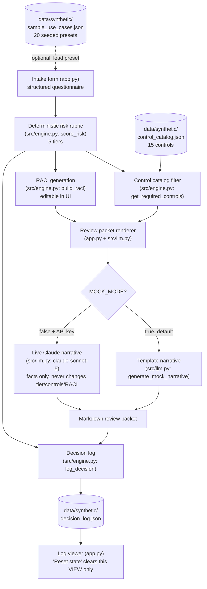

# AI Governance & Risk Triage Agent

**Maturity:** Streamlit Cloud deployment pending · Synthetic data · Transparent governance rubric

> **Disclaimer:** This is an operating-model demonstration built entirely on synthetic data. It is **not legal, privacy, or security advice**, and the scoring rubric, control catalog, and RACI defaults below are illustrative — not a certified compliance framework and not a substitute for your organization's actual AI governance policy or legal review. **There is no real authentication or authorization in this app** — every "role" is a display label, not an access control.

**Public portfolio prototype · Synthetic data**

## 1. Business problem

A business user proposing a new AI use case has no fast, consistent way to know what risk tier it falls into, which controls apply, or who needs to sign off — so governance review either becomes an ad hoc email chain or gets skipped entirely.

## 2. What the agent does

A business user submits a proposed AI use case through a structured intake questionnaire. The app applies a transparent, points-based rubric to assign one of five risk tiers, identifies the required review groups and controls from a standing control catalog, drafts a RACI (Responsible/Accountable/Consulted/Informed) table, generates a markdown governance review packet, and appends the decision to an append-only log — labeling itself decision support throughout, never a legal, security, or compliance determination.

### Scoring rubric (auditable)

Every intake answer contributes independent points, summed into a `risk_score` and bucketed into a tier by four fixed thresholds. This table is mirrored exactly in `src/engine.py`'s module docstring.

| Factor | Value | Points |
|---|---|---|
| Data sensitivity | public | 0 |
| | internal | 1 |
| | confidential | 2 |
| | restricted | 4 |
| Intended users | internal | 0 |
| | both | 1 |
| | external | 2 |
| Automation level | assistive | 0 |
| | semi_autonomous | 2 |
| | fully_autonomous | 4 |
| Decision impact on individuals | low | 0 |
| | medium | 2 |
| | high | 4 |
| Human review present | True | 0 |
| | False | +3 |
| External data sharing | False | 0 |
| | True | +2 |

**Maximum possible score: 19.** Thresholds: **0-2 = Minimal**, **3-6 = Low**, **7-10 = Moderate**, **11-14 = High**, **15-19 = Restricted pending formal review**.

Independently of the score, `external_data_sharing = True` always pulls the **Data Processing Agreement (DPA) review** control into the required list, regardless of which tier the request lands in — one specific fact pattern can trigger a control that raw risk points alone would not. Two controls (`UC-14`, `UC-15`) are exclusive to the Restricted tier, giving that tier's "pending formal review" name a concrete meaning. See `docs/governance.md` for the reasoning behind this shape, the control-catalog ownership model, and how a real organization would version and change-control this rubric.

## 3. What this demo is

- A deterministic, auditable rubric that maps a structured intake questionnaire to one of five risk tiers (Minimal, Low, Moderate, High, Restricted pending formal review), a required-controls list, and a draft RACI.
- A working local Streamlit app you can run and click through end-to-end against synthetic data, including 20 pre-filled sample use cases spanning all five tiers.
- An illustration of an AI-governance *operating model* — how the pieces (intake, scoring, controls, accountability, logging) fit together, and how a real organization would own and change-control the rubric itself (see `docs/governance.md`).

## 4. What this demo is not

- Real authentication or authorization — there is no login, and no role in the UI is access-controlled; every "role" is just a display label.
- A live integration beyond the optional Claude narration call — there is no real CRM, ticketing, HRIS, or data-catalog connection; the control catalog, seeded presets, and decision log are local JSON files.
- A hosted deployment (yet) — see the Deployment section below for status.
- A certified compliance framework — the control catalog, RACI defaults, and scoring rubric are illustrative examples, not a substitute for your organization's actual legal, privacy, and security review process, and not a certified standard (e.g. ISO, NIST, SOC 2).
- Populated with anything but synthetic, fictional data.

## 5. Key workflow

1. **Load a preset or fill in the intake form manually.** The "Load a seeded sample use case" dropdown offers 20 fictional intake examples (`data/synthetic/sample_use_cases.json`) spanning all five risk tiers; picking one pre-fills the form, which remains fully editable.
2. **Submit for assessment.** `IntakeRequest.validate()` runs first — if any required field is missing or invalid, the app shows the errors and never scores the request.
3. **Deterministic scoring.** `src/engine.py::score_risk` sums points across six factors and buckets the total into one of five tiers.
4. **Controls and RACI.** The tier (plus `external_data_sharing`) filters `control_catalog.json` down to the applicable controls; `build_raci` returns a tier-appropriate default RACI, editable in the UI.
5. **Logging.** The completed assessment is appended to `data/synthetic/decision_log.json`.
6. **Review packet.** A markdown packet is assembled from the structured results (plus a mock or Claude-narrated summary paragraph) and can be downloaded.
7. **Reset state.** Clears the intake form, any generated packet, and the in-session decision-log view — without touching the committed `decision_log.json` file.

See `docs/workflow.md` for the full step-by-step walkthrough and `docs/demo-script.md` for a guided 60-90 second script.

## 6. Demo metrics and how each is calculated

| Metric shown in-app | Value | Exact source |
|---|---|---|
| Seeded use cases | **20** | `len(load_sample_use_cases())` in `app.py`, i.e. the literal length of `data/synthetic/sample_use_cases.json` |
| Risk tiers | **5** | `len(RISK_TIERS)` in `app.py`, i.e. the literal length of `src/models.py::RISK_TIERS` |
| Automated tests | **62** | The verified count from running `pytest -v` in this repo (see `docs/evaluation-plan.md`); hardcoded as `VERIFIED_TEST_COUNT` in `app.py` with a comment pointing back to how it was verified |

Deck/portfolio summary line: **"20 synthetic use cases · 5 risk tiers · 62 risk-routing/control tests."**

## 7. Architecture overview



See `docs/architecture.md` for a component-by-component description and `docs/data-model.md` for the underlying data shapes.

## 8. Integration matrix

| Integration | Status | Notes |
|---|---|---|
| LLM narration (Claude) | `mock` by default / `live` when `MOCK_MODE=false` + a valid `ANTHROPIC_API_KEY` | The only integration in this repo with an optional live path. Only rewrites the narrative paragraph; never changes the tier, controls, or RACI. Falls back to the deterministic template on any failure. |
| Control catalog | `mock` | Static local JSON file (`data/synthetic/control_catalog.json`), not a connection to a real GRC/policy system. |
| Seeded intake presets | `mock` | Static local JSON file (`data/synthetic/sample_use_cases.json`), not a real intake queue. |
| Decision log | `mock` | Append-only local JSON file (`data/synthetic/decision_log.json`), not a real ticketing queue or audit-grade write-once store. |
| Requester / directory lookup | `planned` | No real employee/HR-directory integration exists; `business_owner` is free text today. See `docs/production-path.md`. |

## 9. Local setup

```bash
pip install -r requirements.txt
streamlit run app.py
```

Runs fully in **mock mode by default** (`MOCK_MODE=true`) — zero API keys required. The risk rubric, control catalog filtering, RACI generation, seeded presets, and decision log are all real, deterministic logic; only the review packet's opening narrative paragraph is templated text in mock mode.

## 10. Environment variables

Copy `.env.example` to `.env` and edit as needed:

| Variable | Default | Purpose |
|---|---|---|
| `MOCK_MODE` | `true` | When `true`, all logic is deterministic/local — no network calls. Set to `false` to enable live Claude narration. |
| `ANTHROPIC_API_KEY` | *(empty)* | Only read when `MOCK_MODE=false`. Used solely to polish the review packet's narrative paragraph; never changes tier/controls/RACI. If the call fails for any reason, the app falls back to the deterministic template automatically. |

## 11. Deployment instructions

Target: **Streamlit Community Cloud** (share.streamlit.io).

- Repository: this repo.
- Branch: `main`.
- Main file: `app.py`.
- **Default (mock-mode) deploy requires no secrets.**
- For live-mode narration, add `ANTHROPIC_API_KEY` in Streamlit Cloud's app-level **Secrets** panel (Settings -> Secrets), formatted as:
  ```toml
  ANTHROPIC_API_KEY = "sk-ant-..."
  MOCK_MODE = "false"
  ```

This pass did not perform any deployment action — see the Verification section of this repo's release report.

## 12. Test and evaluation approach

See `docs/evaluation-plan.md` for the full plan (what "correct" means and how each test checks it). Summary: **62 automated tests, all passing** (`pytest -v`), across `tests/test_engine.py` (26 — the rubric, thresholds, controls, RACI, decision log), `tests/test_presets.py` (23 — the 20 seeded presets, individually verified against their expected tier), and `tests/test_intake_validation.py` (13 — invalid/incomplete intake handling).

## 13. Accessibility and privacy notes

- Built on native Streamlit widgets (`st.text_input`, `st.selectbox`, `st.checkbox`, `st.data_editor`, `st.button`), which are keyboard-operable and screen-reader-labeled by Streamlit itself; this app does not override that behavior with custom components.
- Streamlit's constraint: focus order and ARIA structure inside `st.data_editor` (the RACI table) and `st.dataframe` (the controls table and decision log) are controlled by Streamlit's own rendering, not by this app — there is no custom focus-order or ARIA layer added here, and none was needed for a single-column form flow.
- Color is never the only signal: the risk-tier color badge is always paired with the tier's text name and the numeric score.
- No PII is collected. All intake fields are either free-text fictional-scenario descriptions (use case name, business owner, model/provider, evaluation method) or fixed-vocabulary selections; the 20 seeded presets and 5 seeded decision-log entries use invented names only.

## 14. Known limitations

See `docs/limitations.md` for the full list. In short: no real authentication, no database (JSON files on disk), no real directory/HRIS/ticketing integration, and the rubric/control catalog/RACI defaults are static and unversioned at runtime (though version-controlled in git). No defects were found during this release pass; one real UI bug (a `StreamlitAPIException` on the original "Reset state" wiring) was found and fixed during this pass — see `docs/limitations.md` for detail.

## 15. Production-readiness roadmap

See `docs/production-path.md` for the expanded version. Summary:

- **Prototype (this repo):** deterministic 5-tier rubric, 15-control catalog, editable RACI, template/live review packet, append-only JSON decision log, 20 seeded intake presets.
- **Pilot:** connect intake to the real requester directory and control catalog owned by governance/legal; route restricted-tier submissions to a real ticketing queue for sign-off instead of a local JSON file.
- **Production:** version and change-control the rubric and control catalog themselves (see `docs/governance.md`); require dual sign-off before a tier or control-mapping change ships; add access controls and immutability (write-once storage) to the decision log for audit purposes.
- **Rollout & adoption measurement:** track intake volume by department, average time-to-sign-off by tier, and the rate of use cases escalated, blocked, or manually overridden at each control/RACI gate.

## 16. Screenshot

Screenshot pending first Streamlit Cloud deploy.

---

For the rubric's governance intent, the control-catalog ownership model, and how a real organization would version and change-control a rubric like this one, see **`docs/governance.md`**. License: MIT — see `LICENSE`.
