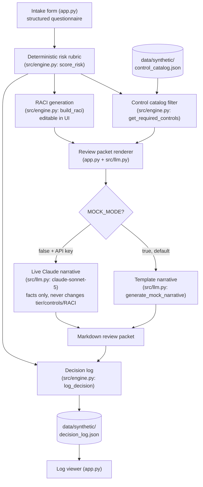

# AI Governance & Risk Triage Agent

**Turns a new AI-use-case proposal into a scored risk tier, a required-controls checklist, a draft RACI, and a logged governance decision in minutes instead of weeks of back-and-forth email.**

> **Disclaimer:** This is an operating-model demonstration built entirely on synthetic data. It is **not legal, privacy, or security advice**, and the scoring rubric below is illustrative — not a substitute for your organization's actual AI governance policy or legal review.

## What this demonstrates

- **Structured intake as the front door to AI governance** — every proposed AI use case answers the same fixed questionnaire, so risk decisions are made on comparable inputs instead of ad hoc conversations.
- **Auditable, rule-based risk scoring** — the risk tier is produced by a small, documented, points-based rubric (not a model's judgment call), so any reviewer can recompute the tier by hand and challenge it.
- **Controls, accountability, and a paper trail as one workflow** — the same assessment that produces a risk tier also pulls the applicable controls from a standing catalog, drafts a RACI, and appends an immutable-style decision-log entry, mirroring how a real governance/risk function operates.

## Demo moment

An employee proposes: *"AI resume-screening assistant, restricted-sensitivity HR data, external candidates, fully autonomous scoring, no human review before a rejection is sent, and it directly affects hiring decisions."*

The agent returns:

- **Risk tier: HIGH** (rubric score 17/19), with the exact factors listed — restricted data (+4), external users (+2), fully autonomous (+4), high decision impact on individuals (+4), no human review present (+3).
- **9 required controls**, including *External legal review of training/data sourcing*, *Bias, fairness, and disparate-impact evaluation*, and *Documented incident response and rollback / kill-switch plan*.
- **A RACI** where Legal and Security are escalated to Accountable sign-off (not just Consulted), alongside the Business Owner.
- **A markdown review packet** ready to attach to the governance ticket, plus a confirmation that the assessment was appended to the decision log.

## Architecture



See `docs/architecture.md` for a component-by-component description.

## Quickstart

```bash
pip install -r requirements.txt
streamlit run app.py
```

Runs fully in **mock mode by default** (`MOCK_MODE=true`) — zero API keys required. The risk rubric, control catalog filtering, RACI generation, and decision log are all real, deterministic logic; only the review packet's opening narrative paragraph is templated text in mock mode.

## Switching to live mode

```bash
cp .env.example .env
```

Then edit `.env`:

```
MOCK_MODE=false
ANTHROPIC_API_KEY=sk-ant-...
```

In live mode, `src/llm.py` asks Claude (`claude-sonnet-5`) to polish the review packet's narrative paragraph from the same computed facts. It cannot change the risk tier, the required controls, or the RACI assignments — those always come from `src/engine.py`. If the live call fails for any reason, the app falls back to the deterministic template automatically.

## Scoring rubric (auditable)

Every intake answer contributes independent points. The total is bucketed into a tier by two fixed thresholds. This table is mirrored exactly in `src/engine.py`'s module docstring.

| Factor | Value | Points |
|---|---|---|
| Data sensitivity | public | 0 |
| | internal | 1 |
| | confidential | 2 |
| | restricted | 4 |
| Intended users | internal | 0 |
| | both | 1 |
| | external | 2 |
| Automation level | assistive | 0 |
| | semi_autonomous | 2 |
| | fully_autonomous | 4 |
| Decision impact on individuals | low | 0 |
| | medium | 2 |
| | high | 4 |
| Human review present | True | 0 |
| | False | +3 |
| External data sharing | False | 0 |
| | True | +2 |

**Maximum possible score: 19.** Thresholds: **0-4 = low**, **5-10 = medium**, **11-19 = high**.

Independently of the score, `external_data_sharing = True` always pulls the **Data Processing Agreement (DPA) review** control into the required list, regardless of which tier the request lands in — one specific fact pattern can trigger a control that raw risk points alone would not.

## Human review, escalation & exceptions

- **The RACI table is a draft, not a decision** — every assignment (R/A/C/I per role) is editable in the UI before the review packet is generated; the tool proposes accountability, a human reviewer confirms it.
- **High-tier requests require named sign-off** — the default RACI escalates Security and Legal from Consulted to Accountable at the high tier, reflecting that these use cases need an explicit approval gate, not just a heads-up.
- **The engine never approves or blocks a use case** — it produces a tier, a control checklist, and a paper trail. A human (the business owner plus the accountable stakeholders in the RACI) still has to complete the listed controls and formally sign off before launch.
- **Escalation path for edge cases** — a use case whose real-world risk isn't captured by the fixed questionnaire (e.g. a novel data type, an unusual jurisdiction) should be escalated to the governance/legal team directly rather than forced through the standard scoring path.

## Evaluation

"Correct" for this agent means:

1. The risk tier is **reproducible by hand** from the intake answers using the rubric table above — no hidden logic.
2. The required-controls list exactly matches the catalog's `required_tiers` and `required_if_external_data_sharing` rules for the assessed tier and inputs — no missed or extra controls.
3. The decision log **accumulates** every completed assessment without overwriting prior entries.

Run the test suite:

```bash
pytest
```

`tests/test_engine.py` asserts three fixtures land in low/medium/high per the documented rubric, confirms `external_data_sharing=True` always pulls in the DPA control regardless of tier, checks the high-tier RACI escalation, and verifies the decision log accumulates entries correctly.

## Roadmap

- **Prototype (this repo):** deterministic rubric, static control catalog, editable RACI, template/live review packet, append-only JSON decision log.
- **Pilot:** connect intake to the real requester directory and control catalog owned by governance/legal; route high-tier submissions to a real ticketing queue for sign-off instead of a local JSON file.
- **Production controls:** version and change-control the rubric and control catalog themselves; require dual sign-off before a tier or control mapping change ships; add access controls and immutability (write-once storage) to the decision log for audit purposes.
- **Rollout & adoption measurement:** track intake volume by department, average time-to-sign-off by tier, and the rate of use cases that get escalated or blocked at each control gate.

## Disclaimer

All data in this repository is synthetic and fictional. This tool is a portfolio demonstration of an AI-governance operating model and is **not legal, privacy, or security advice**. Do not use the rubric, control catalog, or RACI defaults in this repo as a substitute for your organization's actual legal, privacy, and security review processes.

## License

MIT — see `LICENSE`.
