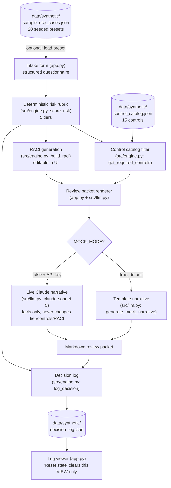

# Architecture

## Component flow

## Components

- **Preset loader (`app.py::load_sample_use_cases`)** — reads
  `data/synthetic/sample_use_cases.json` (20 fictional intake examples
  spanning all five risk tiers) and offers them in a "Load a seeded sample
  use case" dropdown above the intake form; selecting one pushes its fields
  into `st.session_state` so the form below is pre-filled and can be
  assessed or edited before submitting.
- **Intake form (`app.py`)** — a Streamlit form matching every `IntakeRequest`
  field one-to-one: data sensitivity, intended users, automation level,
  external data sharing, model provider, decision impact on individuals,
  human review presence, and evaluation method. A "Reset state" button
  clears the form back to blank defaults, clears any generated
  assessment/packet, and clears the decision-log view for the session
  (without touching the committed `decision_log.json` file on disk).
- **Deterministic risk rubric (`src/engine.py::score_risk`)** — a small,
  documented points table maps each answer to points; the sum is bucketed
  into five tiers (minimal / low / moderate / high / restricted pending
  formal review) against four fixed thresholds. No LLM is involved in this
  step, and every non-zero factor is surfaced back to the user as a
  `risk_factors` string so the tier is auditable, not a black box.
- **Control catalog filter (`src/engine.py::get_required_controls`)** —
  filters `data/synthetic/control_catalog.json` (15 controls) down to the
  ones whose `required_tiers` include the assessed tier, plus any control
  flagged `required_if_external_data_sharing` when the intake says data is
  shared externally — regardless of tier. Two controls (`UC-14`, `UC-15`)
  are exclusive to the restricted tier, reflecting the "pending formal
  review" gate that tier's name promises.
- **RACI generation (`src/engine.py::build_raci`)** — a sensible per-tier
  default (Business Owner / Data Privacy / Security / Legal / IT / End Users)
  that escalates step by step across the five tiers, reaching its most
  conservative form at restricted (Business Owner, Data Privacy, Security,
  and Legal all Accountable; End Users move from Informed to Consulted).
  Fully editable by the reviewer in the Streamlit UI before the packet is
  generated. See `docs/governance.md` for the full escalation ladder and its
  governance rationale.
- **Review packet renderer (`app.py` + `src/llm.py`)** — assembles a markdown
  packet from the structured `RiskAssessment` and the (possibly edited)
  RACI table. `src/llm.py` supplies only the opening narrative paragraph:
  a deterministic template in mock mode, or a Claude-polished version of the
  same facts in live mode. Neither path can alter the tier, the controls, or
  the RACI values — those come only from `src/engine.py`.
- **Decision log (`src/engine.py::log_decision` /
  `data/synthetic/decision_log.json`)** — every completed assessment is
  appended as a timestamped JSON entry (use case, owner, tier, score,
  summary, required control IDs) at runtime. `app.py` includes a small log
  viewer that reads this file back; "Reset state" clears only the in-session
  view of it, never the file.
