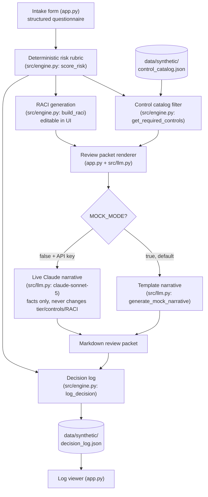

# Architecture

## Component flow

## Components

- **Intake form (`app.py`)** — a Streamlit form matching every `IntakeRequest`
  field one-to-one: data sensitivity, intended users, automation level,
  external data sharing, model provider, decision impact on individuals,
  human review presence, and evaluation method.
- **Deterministic risk rubric (`src/engine.py::score_risk`)** — a small,
  documented points table maps each answer to points; the sum is bucketed
  into low/medium/high against two fixed thresholds. No LLM is involved in
  this step, and every non-zero factor is surfaced back to the user as a
  `risk_factors` string so the tier is auditable, not a black box.
- **Control catalog filter (`src/engine.py::get_required_controls`)** —
  filters `data/synthetic/control_catalog.json` (13 controls) down to the
  ones whose `required_tiers` include the assessed tier, plus any control
  flagged `required_if_external_data_sharing` when the intake says data is
  shared externally — regardless of tier.
- **RACI generation (`src/engine.py::build_raci`)** — a sensible per-tier
  default (Business Owner / Data Privacy / Security / Legal / IT / End Users)
  that escalates Security and Legal from Consulted to Accountable at the
  high tier. Fully editable by the reviewer in the Streamlit UI before the
  packet is generated.
- **Review packet renderer (`app.py` + `src/llm.py`)** — assembles a markdown
  packet from the structured `RiskAssessment` and the (possibly edited)
  RACI table. `src/llm.py` supplies only the opening narrative paragraph:
  a deterministic template in mock mode, or a Claude-polished version of the
  same facts in live mode. Neither path can alter the tier, the controls, or
  the RACI values — those come only from `src/engine.py`.
- **Decision log (`src/engine.py::log_decision` /
  `data/synthetic/decision_log.json`)** — every completed assessment is
  appended as a timestamped JSON entry (use case, owner, tier, score,
  summary, required control IDs) at runtime. `app.py` includes a small log
  viewer that reads this file back.
